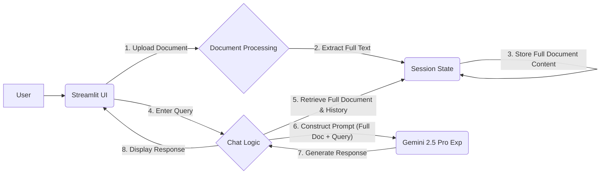
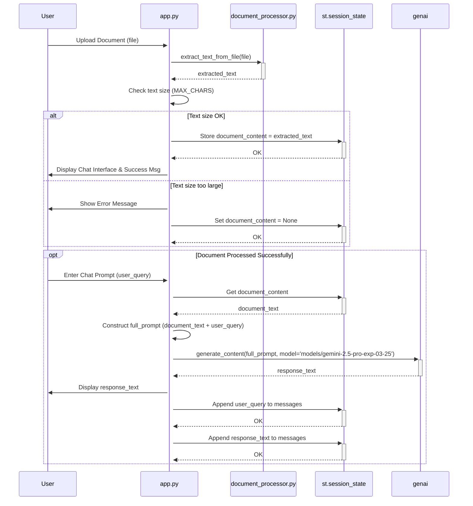

# CAG Chat System - Task List (v3)

## Phase 1: Setup & Basic UI

- [X] **Task 1.1:** Set up Python project environment (e.g., using `venv`).
- [X] **Task 1.2:** Install necessary libraries:
    - `streamlit`
    - `google-generativeai` (for Gemini)
    - `pypdf`
    - `python-docx`
    - `python-dotenv` (for API key management)
- [X] **Task 1.3:** Create the main Streamlit application file (e.g., `app.py`).
- [X] **Task 1.4:** Implement the file uploader widget in the Streamlit UI (accepting .txt, .pdf, .docx).
- [X] **Task 1.5:** Implement the chat input field and the area to display the conversation history.

## Phase 2: Document Processing & Context Handling

- [X] **Task 2.1:** Create functions to extract text content from uploaded .txt, .pdf, and .docx files.
- [X] **Task 2.2:** Implement logic to store the *entire* extracted document content. This content will be loaded into the Gemini context.
    - **Note:** A check for excessively large documents (based on character count) was added.
- [X] **Task 2.3:** Use Streamlit's session state (`st.session_state`) to manage the chat history and the loaded full document content for the user's session.

## Phase 3: Gemini LLM Integration & Chat Logic

- [X] **Task 3.1:** Configure and initialize the connection to the **Google Gemini 2.5 Pro Experimental (`models/gemini-2.5-pro-exp-03-25`)** model using the `google-generativeai` library. Handle API key securely (e.g., via environment variables/.env file).
- [X] **Task 3.1.1:** ~~Investigate and confirm the availability and usage method of Gemini's "context caching" feature via the `google-generativeai` Python library.~~ (Caching disabled as chosen model doesn't support it).
- [X] **Task 3.2:** Develop the logic to construct the prompt for Gemini. This prompt includes the **entire document content** (from Task 2.2) prepended to the current user query. ~~Caching logic removed.~~
- [X] **Task 3.3:** Implement the function that sends the constructed prompt (without caching) to the Gemini API and receives the generated response.
- [X] **Task 3.4:** Update the Streamlit UI to display the Gemini model's response in the chat display area.

## Phase 4: Refinement & Error Handling

- [X] **Task 4.1:** Implement robust error handling:
    - File uploads (unsupported formats, read errors) - Handled.
    - Gemini API interactions (authentication, rate limits, API errors) - Basic handling implemented (API key check, general exception catching). Rate limit error addressed by model change. ~~Caching issues irrelevant.~~
    - Potential context window overflow - Heuristic check implemented.
- [X] **Task 4.2:** Add user feedback (e.g., loading spinners during document processing and LLM calls).
- [ ] **Task 4.3:** Refine the UI/UX for clarity and ease of use (e.g., Clear button).

## Architecture Diagram (Unchanged)

## Sequence Diagram

## Phase 5: Token Counting & Context Limit Handling

- [X] **Task 5.1:** Implement token counting using `model.count_tokens()` for the `models/gemini-2.5-pro-exp-03-25` model.
- [X] **Task 5.2:** Integrate token counting into the file upload process in `app.py` after successful text extraction.
- [X] **Task 5.3:** Store the calculated document token count in `st.session_state`.
- [X] **Task 5.4:** Display the document's token count in the UI (e.g., "Tokens: 150,000 / 1,000,000"). Consider using `st.progress` or similar for visualization.
- [X] **Task 5.5:** Replace the character-based large document check (Task 4.1 refinement) with a check against the accurate document token count and the 1,000,000 token limit.

## Phase 6: Conversational Context (Chat History)

- [X] **Task 6.1:** Modify the `generate_response` function in `app.py` to accept the chat history (`st.session_state.messages`) as an argument.
- [X] **Task 6.2:** Implement logic to format the last N messages (e.g., 4 user/assistant pairs = 8 messages total) from the history into a suitable string format for the prompt.
- [X] **Task 6.3:** Update the prompt construction logic in `generate_response` to combine: Formatted History + Full Document Text + Current User Query.
- [X] **Task 6.4:** Implement a check *before* calling the API to ensure the *combined* token count (history + document + query) does not exceed the 1,000,000 limit. If it does, potentially truncate the *history* first, then notify the user if it still exceeds the limit (document truncation is less desirable for CAG).